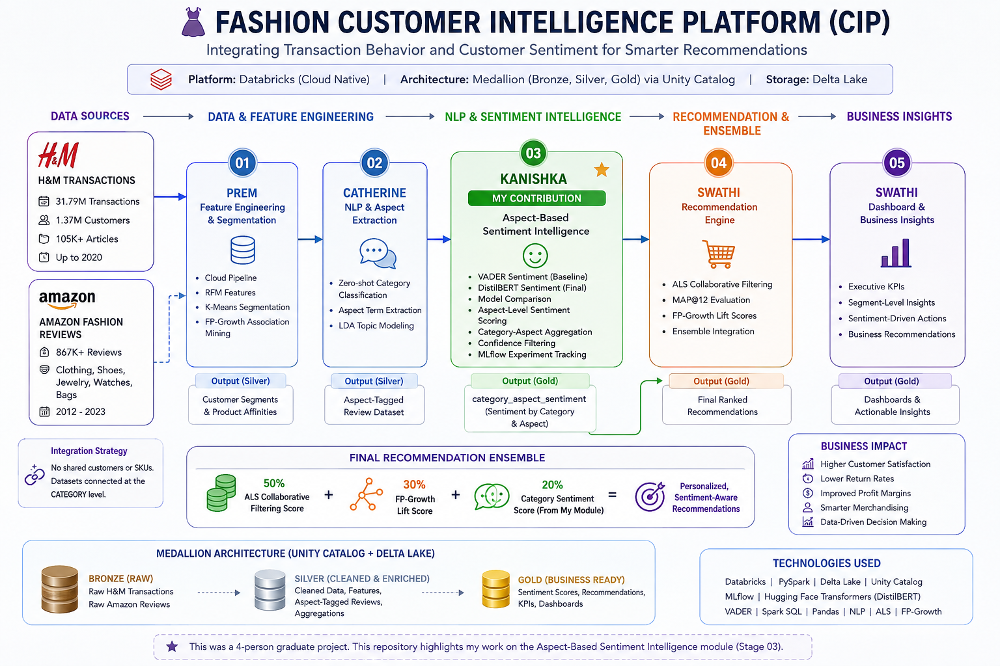

# 👗 Fashion Customer Intelligence Platform — Sentiment & Recommendation Case Study

## 📌 Project Overview

This project documents my contribution to a team-based **Fashion Customer Intelligence Platform (CIP)** developed in Databricks.

The platform combines:

- Large-scale H&M transaction data
- Amazon Fashion review data
- Customer segmentation
- NLP and aspect extraction
- Aspect-based sentiment analysis
- Collaborative filtering
- Association mining
- Executive analytics

The overall solution was implemented using a **Bronze–Silver–Gold Medallion Architecture** in Databricks with Unity Catalog and Delta Lake. :contentReference[oaicite:0]{index=0}

## 🏗️ Platform Architecture

The platform integrates large-scale H&M transaction behavior with Amazon Fashion review intelligence through a category-level bridge. My contribution focused on **Stage 03 — Aspect-Based Sentiment Intelligence**, which produces category-and-aspect sentiment scores used by the downstream recommendation ensemble.

---

---

## 👤 My Contribution

My primary responsibility was the **Aspect-Based Sentiment Intelligence module**.

I developed the notebook:

`03_kanishka_sentiment.ipynb`

The module consumed aspect-tagged Amazon review data and produced the Gold-layer:

`gold.category_aspect_sentiment`

This sentiment output was later used as one of the signals in the final recommendation pipeline. :contentReference[oaicite:1]{index=1}

---

## 🧠 Sentiment Analysis Pipeline

My module included:

- VADER sentiment scoring as a baseline
- DistilBERT transformer-based sentiment scoring
- Comparison of model performance against review star ratings
- Sentence-level aspect-based sentiment analysis
- Category-and-aspect aggregation
- Confidence filtering for final Gold-layer outputs
- MLflow experiment tracking

The final sentiment model used:

`distilbert-base-uncased-finetuned-sst-2-english`

DistilBERT achieved a stronger correlation with star ratings than the VADER baseline and was selected for the final pipeline. :contentReference[oaicite:2]{index=2}

---

## 📊 Model Comparison

| Model | Role | Correlation with Star Rating |
|---|---|---:|
| VADER | Lexicon baseline | 0.56 |
| DistilBERT | Transformer-based final scorer | 0.64 |

DistilBERT was selected because it demonstrated stronger contextual alignment with review ratings. :contentReference[oaicite:3]{index=3}

---

## 🎯 Aspect-Based Sentiment

Instead of assigning one sentiment score to an entire review, the pipeline scored the specific sentence associated with a detected fashion aspect.

Example aspects included:

- Fit
- Comfort
- Quality
- Value
- Shipping

This approach allowed different opinions within the same review to be separated.

For example, a review could express:

- positive sentiment about **quality**
- negative sentiment about **fit**

without collapsing both signals into a single overall sentiment score. :contentReference[oaicite:4]{index=4}

---

## 🏗️ End-to-End Team Architecture

The complete platform consisted of five sequential notebooks:

1. `01_prem_features.ipynb`  
   Cloud pipeline, RFM segmentation, K-Means, FP-Growth

2. `02_cathrine_nlp.ipynb`  
   Zero-shot classification, aspect extraction, LDA

3. `03_kanishka_sentiment.ipynb`  
   **VADER, DistilBERT, aspect-based sentiment aggregation**

4. `04_swati_recommender.ipynb`  
   ALS collaborative filtering, MAP@12 evaluation, ensemble integration

5. `05_swati_dashboard.ipynb`  
   Executive KPIs, segment views, business insights :contentReference[oaicite:5]{index=5}

---

## 🔗 Dataset Integration Strategy

The H&M and Amazon datasets did not share customers or product SKUs, so a direct join was not possible.

The team used a **category-level bridge**:

**Amazon Fashion sentiment → product category → H&M recommendations**

This allowed category-level sentiment to influence recommendation ranking without introducing an artificial product mapping. :contentReference[oaicite:6]{index=6}

---

## 🧪 Final Recommendation Ensemble

The final recommendation score combined:

- **50%** ALS collaborative-filtering signal
- **30%** FP-Growth product-affinity signal
- **20%** category sentiment signal

This is where my sentiment output became part of the recommendation logic. :contentReference[oaicite:7]{index=7}

---

## 🛠️ Tools & Technologies

- Databricks
- Python
- PySpark
- Spark SQL
- Delta Lake
- Unity Catalog
- Hugging Face Transformers
- DistilBERT
- VADER
- MLflow
- Pandas
- NLP
- Aspect-Based Sentiment Analysis

---

## 📦 Data Scale

The broader platform worked with:

- **31.79M** H&M transaction records
- **1.37M** H&M customers
- **105K+** H&M articles
- **867K+** Amazon Fashion reviews

Because transformer inference was computationally expensive on the shared cluster, the NLP stage used a balanced 1,000-review sample, producing 927 aspect spans for downstream sentiment scoring. :contentReference[oaicite:8]{index=8} :contentReference[oaicite:9]{index=9}

---

## ✅ Key Output

The final Gold sentiment table aggregated sentiment by:

**Category × Aspect**

and applied a minimum review-count threshold to reduce unreliable low-volume signals. :contentReference[oaicite:10]{index=10}

This provided sentiment intelligence that could be used to:

- identify recurring customer concerns
- prioritize operational improvements
- down-weight negatively perceived categories in recommendation ranking
- support sentiment-aware merchandising decisions

---

## ⚠️ Limitations

Key limitations included:

- Transformer inference was sample-bounded because of shared-cluster compute constraints
- DistilBERT was used as a pre-trained SST-2 model without fashion-specific fine-tuning
- Full-corpus distributed inference was outside the project scope
- The H&M transaction window ends in 2020, so specific consumer patterns are historical

These limitations were documented as future areas for improvement. :contentReference[oaicite:11]{index=11}

---

## 🚀 Potential Improvements

Future enhancements could include:

- Scaling sentiment inference to the full review corpus
- Fine-tuning DistilBERT on fashion-specific aspect sentiment
- Adding TF-IDF content-based recommendation signals
- Using a LightGBM learning-to-rank model
- Expanding recommendation coverage
- Deploying with MLflow Model Registry and automated Databricks workflows :contentReference[oaicite:12]{index=12}

---

## 🤝 Collaboration Note

This was a four-person graduate analytics project.

This public repository focuses primarily on **my sentiment-analysis contribution** while documenting how that module integrated into the broader team pipeline.

The original project architecture and module ownership are preserved for clear attribution. :contentReference[oaicite:13]{index=13}

---

## 👤 Author

**Kanishka Skandaraj**  
MSc Data Analytics Candidate  
University of Niagara Falls Canada
